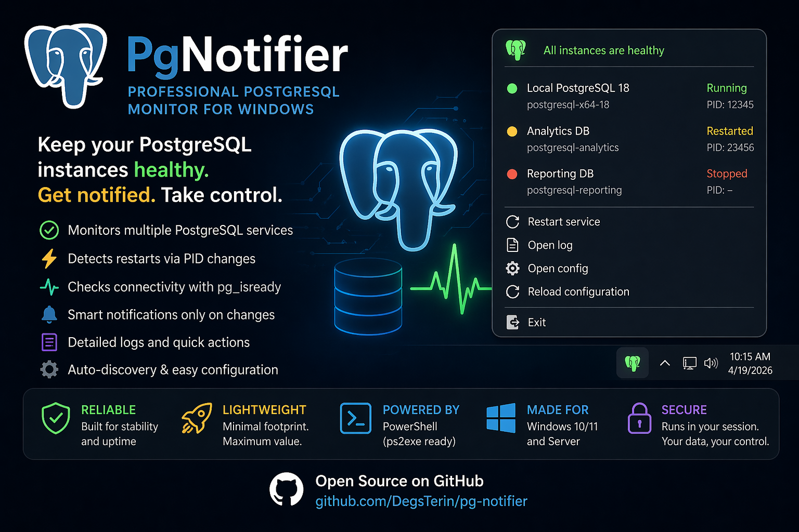

# PgNotifier

PgNotifier is a professional PostgreSQL monitoring tool for Windows 10 and 11, built in PowerShell and inspired by the MySQL Notifier experience. It runs in the system tray, checks the health of one or more PostgreSQL services, detects service restarts through PID changes, and surfaces status changes through icons, notifications, logs, and quick actions.

<p align="center">
  
</p>

## Highlights

- System tray application with `NotifyIcon`
- Forces STA execution for WinForms compatibility
- Monitors PostgreSQL Windows services (`Running`, `Stopped`, missing service)
- Validates connectivity with `pg_isready`
- Detects restarts when the Windows service PID changes
- Uses color states:
  - Green: healthy and accepting connections
  - Red: stopped, missing service, timeout, or no connectivity
  - Yellow: recently restarted
- Emits balloon notifications only when state changes
- Logs all relevant events with timestamp
- Supports JSON configuration
- Supports multiple PostgreSQL instances
- Supports auto-discovery of installed PostgreSQL services
- Lets the operator restart a service from the tray menu
- Lets the operator open the log or configuration file from the tray menu
- Supports silent mode and configurable notification behavior
- Supports configurable timeout and retry behavior for `pg_isready`
- Prepared for packaging as `.exe` and Windows installer

## Project structure

```text
PgNotifier/
|-- build/
|   `-- build.ps1
|-- config/
|   `-- appsettings.json
|-- dist/
|   |-- installers/
|   `-- packages/
|-- examples/
|   `-- appsettings.sample.json
|-- packaging/
|   `-- inno/
|       `-- PgNotifier.iss
|-- src/
|   |-- PgNotifier.ps1
|   `-- Modules/
|       `-- PgNotifier/
|           |-- PgNotifier.psd1
|           `-- PgNotifier.psm1
|-- tests/
|   `-- PgNotifier.Tests.ps1
|-- .gitignore
|-- LICENSE
`-- README.md
```

## Requirements

- Windows 10 or Windows 11
- Windows PowerShell 5.1 or PowerShell 7 running on Windows
- PostgreSQL client tools recommended for best results, especially `pg_isready.exe`
- Permission to query Windows services
- Administrator permission only when you want the tray menu to restart services

## How it works

PgNotifier creates a Windows tray icon and polls each configured PostgreSQL instance on a configurable interval. For each instance it:

1. Queries the Windows service status through `Win32_Service`.
2. Checks connectivity with `pg_isready`.
3. Compares the current PID with the previous PID to detect restarts.
4. Updates the tray icon based on the aggregate health of all monitored instances.
5. Emits notifications only when the state changes.
6. Writes structured log entries to the configured log file.

## Configuration

The default configuration file is `config/appsettings.json` during development. When installed through the Windows installer, the configuration is copied to:

```text
C:\ProgramData\PgNotifier\appsettings.json
```

### Configuration example

```json
{
  "application": {
    "displayName": "PgNotifier",
    "intervalSeconds": 5,
    "restartBadgeSeconds": 10,
    "startMinimized": true,
    "autoDiscover": true,
    "silentMode": false
  },
  "logging": {
    "logPath": "%LocalAppData%\\PgNotifier\\logs\\pgnotifier.log",
    "level": "INFO"
  },
  "notifications": {
    "enabled": true,
    "suppressStartupBalloon": false,
    "defaultBalloonTimeoutMs": 3000
  },
  "pgIsReady": {
    "path": "C:\\Program Files\\PostgreSQL\\18\\bin\\pg_isready.exe",
    "timeoutSeconds": 5,
    "retryCount": 2,
    "retryDelayMs": 1000,
    "extraArguments": []
  },
  "instances": [
    {
      "name": "Local PostgreSQL 18",
      "serviceName": "postgresql-x64-18",
      "hostName": "localhost",
      "port": 5432,
      "postgresExe": "C:\\Program Files\\PostgreSQL\\18\\bin\\postgres.exe",
      "enabled": true,
      "notificationsEnabled": true,
      "restartAllowed": true
    }
  ]
}
```

### Configuration fields

- `application.displayName`: application name shown in the tray tooltip and menu.
- `application.intervalSeconds`: polling interval.
- `application.restartBadgeSeconds`: how long the icon stays yellow after a restart.
- `application.autoDiscover`: when `true`, automatically adds PostgreSQL Windows services not explicitly listed.
- `application.silentMode`: disables balloon notifications without disabling monitoring.
- `logging.logPath`: log file destination. `%LocalAppData%` is recommended so the tray app can always write logs as the signed-in user.
- `notifications.enabled`: master switch for tray notifications.
- `notifications.suppressStartupBalloon`: skips the startup notification.
- `pgIsReady.path`: full path or command name for `pg_isready.exe`. If omitted or not found, PgNotifier falls back to a TCP connectivity check.
- `pgIsReady.timeoutSeconds`: timeout per connectivity attempt.
- `pgIsReady.retryCount`: number of retries after the first attempt fails.
- `pgIsReady.retryDelayMs`: delay between retries.
- `instances`: explicit PostgreSQL instances to monitor.

## Running in development

Open PowerShell and run:

```powershell
powershell.exe -NoProfile -ExecutionPolicy Bypass -STA -File .\src\PgNotifier.ps1 -ConfigPath .\config\appsettings.json
```

The bootstrap script will also relaunch itself in STA mode if needed.

## Tray menu actions

- `Instances`: shows each monitored PostgreSQL instance and its current state.
- `Restart service`: restarts the corresponding Windows service.
- `Silent mode`: toggles notifications on or off without stopping monitoring.
- `Open log`: opens the current log file in Notepad.
- `Open config`: opens the JSON configuration file in Notepad.
- `Reload configuration`: reloads the JSON file without reinstalling.
- `Exit`: stops monitoring and disposes tray resources cleanly.

## Logging

PgNotifier writes UTF-8 logs with timestamps, for example:

```text
2026-04-19 10:15:00 [INFO] Application starting with config 'C:\ProgramData\PgNotifier\appsettings.json'.
2026-04-19 10:15:05 [INFO] State change for postgresql-x64-18: UP - Accepting connections on localhost:5432.
2026-04-19 10:16:10 [WARN] Restart detected for postgresql-x64-18. PID 4120 -> 5904
```

## Build and packaging

### 1. Build prerequisites

Install the packaging tools:

```powershell
Install-Module ps2exe -Scope CurrentUser
```

Install [Inno Setup](https://jrsoftware.org/isdl.php) and ensure `ISCC.exe` is available in `PATH`.

### 2. Build only the executable

This is the recommended path if you do not have Inno Setup installed:

```powershell
.\build\build.ps1 -Version 1.0.0 -SkipInstaller
```

This generates:

- `dist\packages\PgNotifier-1.0.0\PgNotifier.exe`
- `dist\packages\PgNotifier-1.0.0\config\appsettings.json`

### 3. Build the executable and installer

```powershell
.\build\build.ps1 -Version 1.0.0
```

This generates:

- `dist\packages\PgNotifier-1.0.0\PgNotifier.exe`
- `dist\packages\PgNotifier-1.0.0\config\appsettings.json`
- `dist\installers\PgNotifier-Setup-1.0.0.exe`

If Inno Setup is not installed, the script will generate the package and skip installer generation with a warning.

### 4. Build only the installer from an existing package

```powershell
.\build\build.ps1 -Version 1.0.0 -InstallerOnly
```

## Installer behavior

The bundled Inno Setup installer script lives in `packaging\inno\PgNotifier.iss`.

The generated installer executable is written to `dist\installers`.

The bundled Inno Setup installer:

- Installs PgNotifier under `C:\Program Files\PgNotifier`
- Copies the default configuration to `C:\ProgramData\PgNotifier\appsettings.json`
- Offers an option to start with Windows
- Offers an option to create a desktop shortcut
- Can launch PgNotifier immediately after setup

## Testing

If Pester is available, run:

```powershell
Invoke-Pester .\tests\PgNotifier.Tests.ps1
```

Current tests validate the module manifest and sample configuration. You can expand them with service mocks and connectivity simulations as the project grows.

## Recommended GitHub repository setup

- Repository name: `pg-notifier`
- Default branch: `main`
- Topics: `powershell`, `postgresql`, `windows`, `tray-app`, `devops`, `monitoring`
- Suggested labels: `bug`, `enhancement`, `documentation`, `installer`, `monitoring`

## Suggested versioning strategy

Use Semantic Versioning:

- `MAJOR`: breaking changes to configuration, packaging, or tray behavior
- `MINOR`: new monitoring capabilities or operator features
- `PATCH`: bug fixes, compatibility fixes, and documentation updates

Suggested release cadence:

- `1.0.0`: first production-ready release
- `1.1.0`: optional auto-start registration improvements and richer logs
- `1.2.0`: optional metrics export, Windows Event Log integration, health history

## Suggested future roadmap

- Optional Windows Event Log integration
- Optional export of metrics to Prometheus text format
- Optional service credentials validation before restart
- Optional custom icons and branding assets
- Optional signed installer and signed executable for enterprise distribution
- Optional CI pipeline for lint, tests, packaging, and GitHub Releases

## License

This project uses the MIT license. See `LICENSE` for details.
Startup diagnostics are written to `%LocalAppData%\PgNotifier\logs\startup-errors.log` so the tray app does not fail when running without administrative write access to `ProgramData`.
